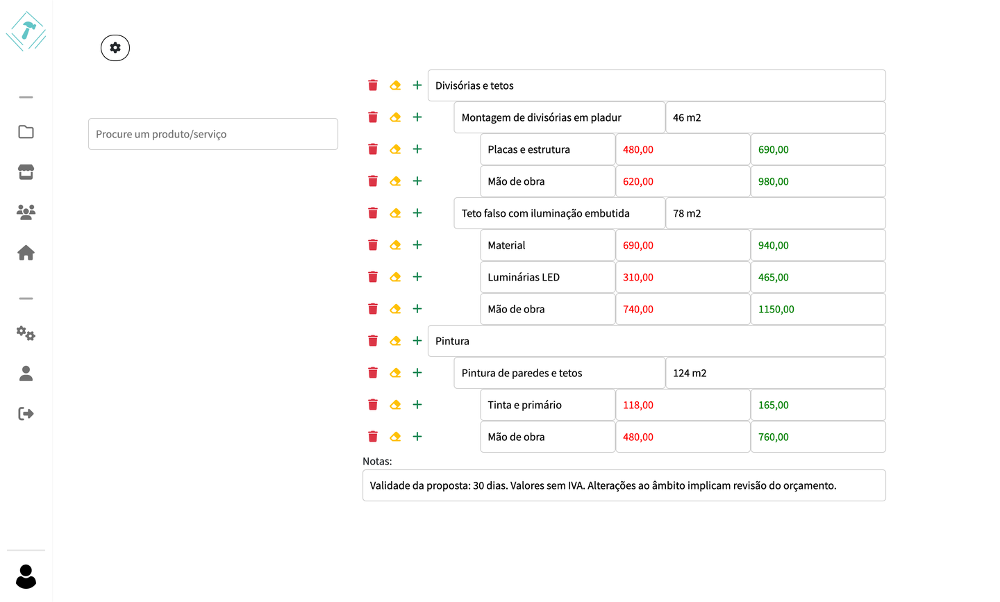
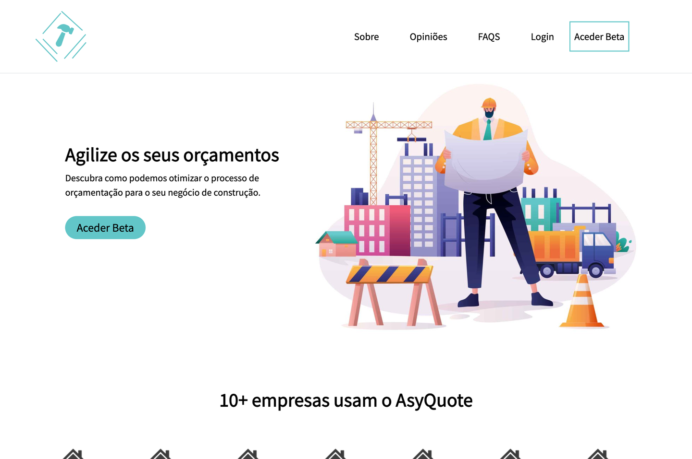
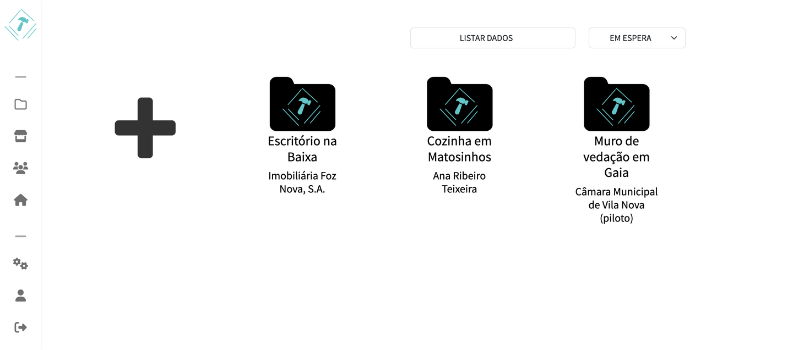
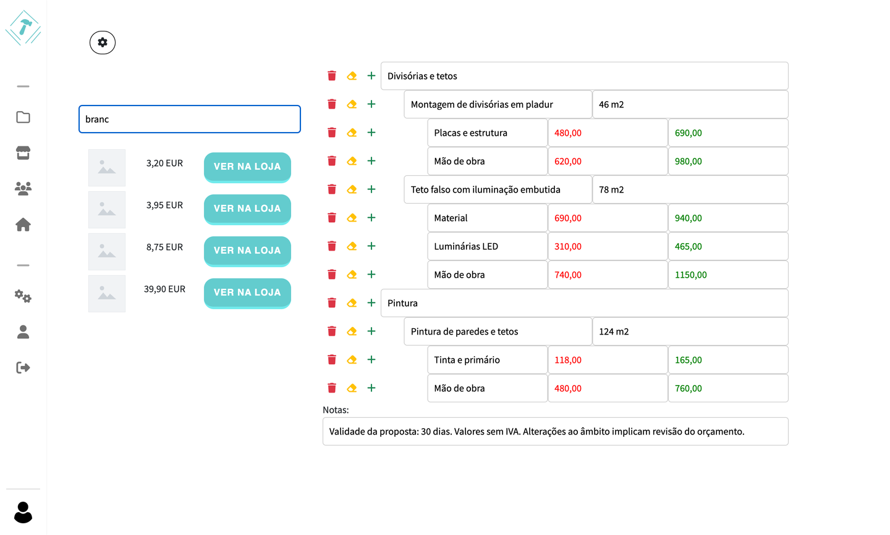
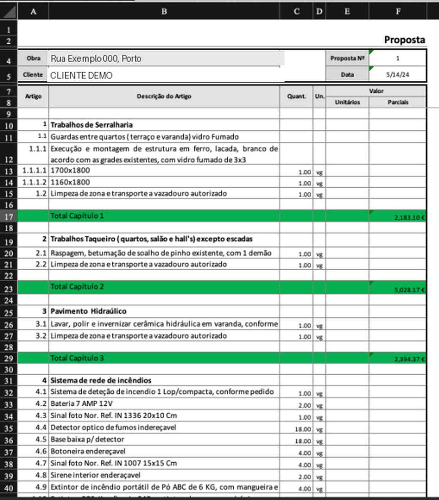
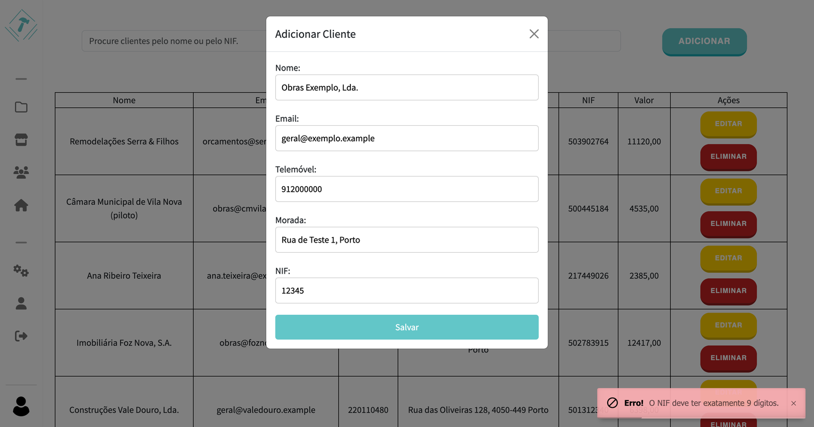
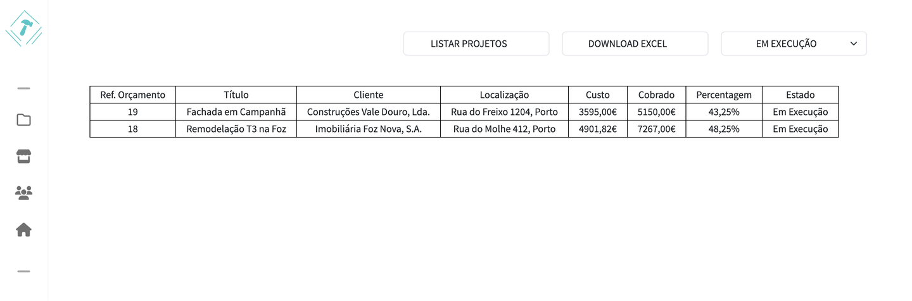
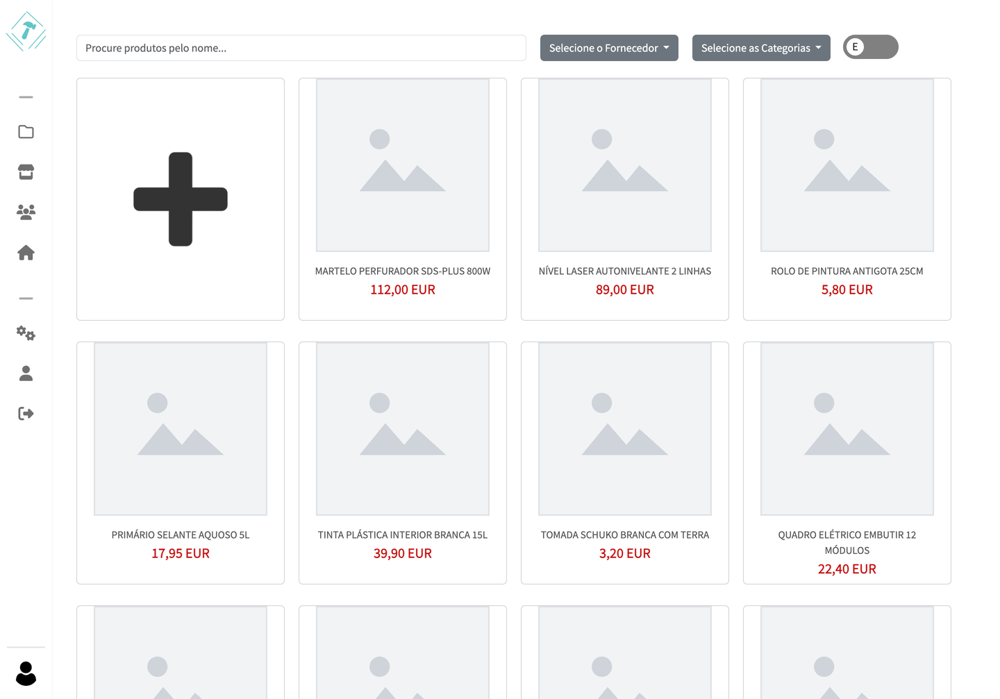
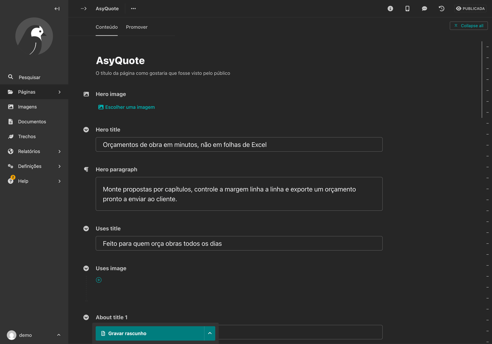

# AsyQuote

A quoting SaaS for construction firms: build a proposal as nested chapters of
priced line items, track cost against what the client is charged, and export a
formatted spreadsheet ready to send.

<p align="center">
  
</p>

<table>
<tr>
<td width="50%"><br><sub><b>Public site</b> — content managed in Wagtail</sub></td>
<td width="50%"><br><sub><b>Projects explorer</b> — filtered by quote state</sub></td>
</tr>
<tr>
<td><br><sub><b>Product search</b> — cheapest supplier price, in-place</sub></td>
<td><br><sub><b>Excel export</b> — chapter subtotals, print-ready</sub></td>
</tr>
<tr>
<td><br><sub><b>Clients</b> — tax number (NIF) validation</sub></td>
<td><br><sub><b>Margin table</b> — cost vs charged per quote</sub></td>
</tr>
<tr>
<td><br><sub><b>Catalogue</b> — supplier/category filters</sub></td>
<td><br><sub><b>Wagtail backoffice</b> — landing page fields</sub></td>
</tr>
</table>

> Screenshots come from the application running against
> `fixtures/demo_data.json`. The landing page uses the project's own artwork,
> already committed under `asyquote/media/`. Catalogue products ship without
> photos, hence the placeholder thumbnails.

## The problem

Small construction firms quote by hand. A proposal is assembled in a
spreadsheet, material prices are looked up one supplier site at a time, and the
margin on each line is whatever the person doing it remembers to add. Rebuilding
the same quote for a different client means copying a file and editing it. The
dedicated tools that solve this are priced for large contractors, so the
alternative below them is Excel.

AsyQuote sits in that gap: structured quotes, a searchable price catalogue
pulled from supplier sites, and an export that still hands the client a
spreadsheet.

## Features

**Quoting**

- Quotes composed of chapters → services → price lines, added and removed inline
- Cost and charged tracked per line; margin in money and percentage derived from both
- Type a number followed by `%` in the charged field to price a line off its cost
- Per-quote notes carried into the export
- Export a single quote, or a filtered set of quotes, as `.xlsx`

**Catalogue**

- Products with a category and one link + price per supplier
- Lowest-price-across-suppliers surfaced in listings and in the builder's search
- Filter by supplier and category; search by name
- In-page backoffice for superusers: create/edit products, categories, suppliers
- Bulk import products from a spreadsheet, downloading product images concurrently

**Clients and projects**

- Clients scoped to their owner, with NIF format and duplicate checks
- Client total value aggregated from their quotes
- Quotes carry a state (awaiting, in progress, won, lost) and are filterable by it
- Deletion guards: a client with quotes, or a supplier/category with products, cannot be removed

**Accounts**

- Registration with mandatory email verification and a reCAPTCHA challenge
- Password reset over a short-lived token
- Self-service account page: change password, change email, marketing preferences

**Content**

- Wagtail-managed landing page, FAQs, testimonials, footer and navigation

## Stack

|              |                                                           |
| ------------ | --------------------------------------------------------- |
| Backend      | Django 4.2, Python 3.11                                   |
| CMS          | Wagtail 5.2 (`wagtailmenus`, `wagtail-modeladmin`)        |
| Database     | PostgreSQL 15                                             |
| Auth         | `django-allauth` 0.57, Argon2 hashing, `django-recaptcha` |
| Spreadsheets | `openpyxl` (export), `pandas` (scraper output)            |
| Scraping     | `aiohttp` + `asyncio`, BeautifulSoup                      |
| Frontend     | Django templates, Bootstrap 5, jQuery AJAX, gulp/Sass     |
| Layout       | generated from `cookiecutter-django`                      |

## Architecture

```
config/            settings (base / local / production / test), root urlconf, wsgi
asyquote/
  users/           custom User, allauth adapters, signup form with captcha
  clients/         Client, owner-scoped list, NIF validation
  products/        Supplier, Category, Links, Products; catalogue + Excel import
  projects/        Project and the quote tree; builder endpoints; Excel exports
  landingpage/     Wagtail Homepage and the snippets the public site renders from
  utils/           context processors feeding footer/navigation snippets
  templates/       one directory per app area, plus AJAX partials
  static/          Sass sources, compiled CSS, per-page JS bundles
settings_conta/    account settings page and allauth view overrides
scrappers/         the supplier catalogue scraper (standalone script)
compose/           Dockerfile, entrypoint and start script for the dev container
fixtures/          demo_data.json
```

The data model has two halves that meet at the quote.

**The quote tree** is four tables — `Project`, `SectionQuote`, `ServicesQuote`,
`PricesQuote` — joined not by foreign keys but by a `project_key` UUID plus
integer position columns (`section_count`, `services_key`, `prices_count`).
Rows are hidden with a `visible` flag rather than deleted. `Project.total_cost`,
`total_charged` and `profit_percentage` aggregate over `PricesQuote`;
`PricesQuote.save` derives the per-line profit.

**The catalogue** is conventional: `Products` has a `Category` foreign key and
many-to-many links to `Supplier` and to `Links`, where each `Links` row is one
supplier's URL and price for that product. `Products.minimum_price_info` picks
the cheapest of them, which is what the builder's search returns.

`Client` and `Project` both carry a `user` foreign key; ownership is enforced in
each view rather than by a manager.

More detail, including the known weaknesses of this design, is in
[docs/ARCHITECTURE.md](docs/ARCHITECTURE.md).

## Technical highlights

### Concurrent supplier catalogue scraping

`scrappers/peixoto2.py` builds the price catalogue that the quote builder
searches. There is no supplier API, so it walks a supplier's storefront.

It runs in two passes. The first fetches the storefront's category menu and
resolves it to a de-duplicated list of category URLs, which it writes to
`products_links.xlsx` — the category map is a checkpoint, so a failed run
resumes from the spreadsheet instead of re-crawling the menu.

The second pass walks each category. Product listings are paginated and the
page count is not published, so the scraper requests **pages in batches of ten**
against a single `aiohttp.ClientSession` and awaits them with
`asyncio.gather`, then parses all ten responses before advancing the window. It
stops when a page comes back with no price on it. Sequentially each page costs a
full round trip before the next request can leave; batched, ten requests are in
flight at once, so a category's wall-clock time is bounded by the slowest
request in each batch rather than the sum of every request. The ceiling is the
network, not the parser — which is why the batch size is fixed rather than
unbounded. Transient `ServerDisconnectedError` is retried with exponential
backoff (`2 ** attempt`, ten attempts) so one dropped connection does not lose
the batch.

Product images are downloaded the same way: one `gather` over every image URL in
the category, writing with `aiofiles`.

Each category is normalised to a fixed six-column sheet — title, product URL,
price, image URL, category, supplier — which is exactly the shape
`products.views.upload_excel` expects. Import resolves the category by name
(creating it if new), requires the supplier to exist already, replaces the
existing products for that supplier/category pair, then downloads all product
images concurrently before writing rows.

**On robots.txt:** the target site's `robots.txt` was read before any of this was
written. It disallows account, login and password paths and permits the rest;
product listings are not restricted. That check is what the crawl rests on, and
it is a manual, up-front decision recorded in the project report — the scraper
does **not** parse `robots.txt` at runtime, and it should (see below).

### The quote builder

The builder is a single page that mutates the quote tree over AJAX; every
keystroke that changes a value hits `save_quote_data` and gets back a re-rendered
partial, so the tree on screen is always the tree in the database.

Structure is positional. Adding a chapter takes `Max('section_count')` for the
quote and inserts at the next index, seeding it with one service and one price
line so the new chapter is never empty. Deleting sets `visible = False` on the
row and its descendants after checking that at least one sibling remains, so a
quote always has a chapter, a chapter always has a service, and a service always
has a price line.

Margin has two entry points. Per line, `PricesQuote.save` computes
`charged - cost` and its percentage. Going the other way, typing a number and
pressing `%` in a charged field reads the paired cost input and fills in
`cost + cost * n/100` — pricing a line off its cost instead of doing the
arithmetic first.

The product search in the sidebar annotates each match with
`Subquery(Min('price'))` over its supplier links and orders by it, so results
arrive cheapest-first with a single query rather than N per product.

### The Excel export

`download_project_quote` writes the proposal with `openpyxl` rather than dumping
a table. Column widths are set to the proposal's own layout, the header block is
merged and bordered, and articles are numbered by position in the tree —
chapter `1`, service `1.1`, and so on. Quantities are parsed out of the free-text
quantity field by splitting digits from the unit, so `46 m2` becomes `46` and
`m2` in separate cells. Line totals are written as **live formulas**
(`=C12*E12`) rather than computed values, so the client can adjust a quantity in
the file they receive and watch the total follow. Chapter subtotals get a green
fill, the proposal total a grey one.

Print setup is the part that matters in practice: `print_title_rows = '1:4'`
repeats the client/proposal header on every printed page, and the fixed column
widths mean the sheet paginates predictably. There is no direct PDF export — the
spreadsheet is configured so that printing or "save as PDF" produces a usable
document.

### Authentication

Signup runs through `django-allauth` with `ACCOUNT_EMAIL_VERIFICATION =
"mandatory"`, so an account cannot reach the builder before its address is
confirmed, and `UserSignupForm` adds a reCAPTCHA v2 checkbox to the form.

Passwords are hashed with Argon2 and checked against Django's four validators:
similarity to the username and email, an 8-character minimum, the
`CommonPasswordValidator` blocklist of the 20,000 most common passwords, and a
numeric-only check. These are Django's stock validators, not custom code — the
work was in choosing Argon2 over the default PBKDF2 and turning the set on.

Password reset links expire after two minutes (`PASSWORD_RESET_TIMEOUT = 120`),
narrowing the window in which an intercepted reset email is useful.

## Running locally

Requires Docker.

```bash
git clone https://github.com/GoncaloAS/AsyQuote.git
cd AsyQuote
cp .env.example .env
docker compose up --build
```

That is the whole setup. When the log reads `Starting development server`, open
**http://localhost:8000**.

Two separate things populate the database, which matters if you run the
commands yourself:

- **`migrate` builds the public site.** The landing page's copy, imagery,
  footer snippets and navigation menu live in the database, so a migration
  (`landingpage/0002_seed_landing_page_content`) creates them. Migrating an
  empty database is enough to get the institutional page, `/login/` and
  `/aceder-beta/`.
- **`loaddata fixtures/demo_data.json` adds sample business data** — one
  account, five client companies, a fifteen-product catalogue and seven quotes.
  Optional; without it the app works but the builder is empty. The `django`
  service loads it automatically on the first boot of an empty database.

Sign in at `/login/` with:

```
username: demo
password: asyquote-demo
```

That account is a superuser, so the Wagtail backoffice at `/admin/` and the
Django admin at `/django-admin/` are both reachable.

Registration works locally too. `.env.example` leaves the reCAPTCHA keys blank,
which falls back to Google's public test keys, so the checkbox renders and
always validates. Email uses the console backend, so the verification link for a
new account is printed in the `docker compose` log rather than sent.

<details>
<summary>Without Docker</summary>

Needs Python 3.11 and a running PostgreSQL 15.

```bash
python -m venv venv && source venv/bin/activate
pip install -r requirements/local.txt

createdb asyquote
export DJANGO_SETTINGS_MODULE=config.settings.local
export DATABASE_URL=postgres:///asyquote

python manage.py migrate                             # builds the public site
python manage.py loaddata fixtures/demo_data.json    # optional demo business data
python manage.py runserver
```

</details>

<details>
<summary>Tests, linting and assets</summary>

```bash
pytest                       # test suite (users app only)
black . && flake8            # formatting and linting
pre-commit run --all-files   # everything the hooks cover
npm install && npm run build # recompile Sass; committed CSS is already current
```

`.pre-commit-config.yaml` also runs isort, pyupgrade, django-upgrade, prettier
and djLint. Note that flake8 is what is configured here, not ruff.

</details>

## Status & what I'd do differently

Built in 2023/24 as my final secondary-school project (_Prova de Aptidão
Profissional_, graded 20/20). It is **not maintained** — Django 4.2 and Wagtail
5.2 are both behind, and I am not taking issues or pull requests. It is public
as a work sample; the commit history before the cleanup was, honestly, a mess of
`everything backup` commits.

Things I would build differently now:

**The quote tree should use foreign keys.** Joining `SectionQuote`,
`ServicesQuote` and `PricesQuote` on a `project_key` UUID plus integer position
columns means the database cannot enforce that a price line belongs to a real
service, cascade a delete, or index the relationship usefully. Every lookup
filters on three loose integers. Real `ForeignKey`s with an `order` field, or
`django-mptt` for the nesting, would delete most of the position arithmetic in
`views.py` along with the class of bug where two rows share a `section_count`.

**Ownership belongs in the queryset, not in each view.** `edit_project` checks
`project.user != request.user`, but `save_quote_data`, `save_quote_url`,
`create_fields_quote` and `delete_fields_quote` fetch by `project_key` alone —
so a logged-in user who knows another user's quote UUID can edit it. Those views
also mutate state over `GET`, outside CSRF protection. The fix is one owner-aware
manager plus `@login_required` and POST on everything that writes, rather than
per-view discipline that was applied unevenly.

**`quote_number` is a `CharField` that the code treats as an integer.**
`ProjectForm` computes the next number with
`int(last_quote.quote_number) + 1` over a queryset ordered
`-quote_number`, which sorts lexicographically — so `"9"` outranks `"10"`, and
any non-numeric value raises `ValueError` while rendering the page. It should be
an integer with a per-user unique constraint, and the sequence should be
allocated in the database rather than read-modify-written in a form.

**The scraper should be a management command that honours `robots.txt` at
runtime.** As a standalone script with module-level mutable state and a
`global teller` flag controlling the loop, it cannot be tested, scheduled, or
run against a second supplier without copying the file. It also writes
spreadsheets for a human to re-upload, when it could write to the database
directly — `upload_excel` inserts row by row instead of using `bulk_create`, and
deletes the previous products for a category before the new ones are confirmed
good. Reading `robots.txt` with `urllib.robotparser` on each run, and respecting
`Crawl-delay`, would replace a decision I made once by hand with one the code
re-checks every time.

**And there are no tests worth the name.** The suite covers the cookiecutter
users app and nothing else — not the margin arithmetic, not the Excel export,
not the quote tree operations. The margin calculations in particular are pure
functions over decimals and would have been cheap to pin down.

## License

MIT — see [LICENSE](LICENSE).
